# ScribbeAI Multi-Agent Architecture Flow

```mermaid
flowchart TD
    Client[👤 Client] --> Frontend[🖥️ Frontend<br/>Next.js Chat Interface]
    Frontend --> Auth[🔐 Auth Check<br/>Cognito Validation]
    
    Auth --> RBAC{🛡️ RBAC Check<br/>Role Permission?}
    RBAC -->|❌ NO| AccessDenied[🚫 Access Denied<br/>Error Response]
    RBAC -->|✅ YES| RequestRouter[🎯 Request Router<br/>API Gateway]
    
    RequestRouter --> Orchestrator[🧠 AI Orchestrator<br/>Multi-Agent Lambda]
    
    %% Pre-filtering
    Orchestrator --> PreFilter{🔍 Pre-filtering<br/>Intent Classification}
    PreFilter --> IntentValidator[📝 Intent Validator Module]
    
    IntentValidator --> IntentCheck{🤔 Is request<br/>clearly categorized?}
    IntentCheck -->|❌ NO| Client
    IntentCheck -->|✅ YES| AgentSelection[🎪 Agent Selection]
    
    %% Agent Selection Block
    subgraph AgentSelection [🎪 Agent Selection]
        PresentationCheck{📊 Presentation<br/>Request?}
        DocumentCheck{📄 Document<br/>Analysis?}
        FinancialCheck{💰 Financial<br/>Data Analysis?}
        ChatCheck{💬 General<br/>Chat?}
    end
    
    %% Presentation Agent Flow
    PresentationCheck -->|✅ YES| PresentationAgent[📊 Presentation Agent]
    PresentationAgent --> TemplateSelector{🎯 Template<br/>Selection}
    TemplateSelector -->|PE/IB| FinancialTemplates[💼 Financial Templates<br/>PE & IB Decks]
    TemplateSelector -->|Standard| StandardTemplates[📋 Standard Templates<br/>General Presentations]
    FinancialTemplates --> PPTModule[🎨 PowerPoint Module<br/>python-pptx + OpenXML]
    StandardTemplates --> PPTModule
    PPTModule --> SlideAPIs[🔗 Slide Generation APIs<br/>SlideSpeak/SlidesGPT/AiPPT]
    SlideAPIs --> PPTValidator[✅ PPT Validator Module]
    PPTValidator --> PPTCheck{📋 Is PPT<br/>generation correct?}
    PPTCheck -->|❌ NO| PPTFeedback[📝 Feedback:<br/>Regeneration needed]
    PPTFeedback --> PresentationAgent
    PPTCheck -->|✅ YES| PPTExecution[⚡ PPT Execution<br/>S3 Upload]
    
    %% Document Agent Flow  
    DocumentCheck -->|✅ YES| DocumentAgent[📄 Document Agent]
    DocumentAgent --> DocParser{📑 Document<br/>Parser Selection}
    DocParser -->|Structured| UnstructuredAPI[🔧 Unstructured API<br/>Multi-format Parser]
    DocParser -->|Complex| ReductoAPI[⚡ Reducto API<br/>Advanced Extraction]
    DocParser -->|Indexed| LlamaIndex[🦙 LlamaIndex<br/>Document Indexing]
    UnstructuredAPI --> RAGModule[🔍 RAG Module<br/>Bedrock Knowledge Base]
    ReductoAPI --> RAGModule
    LlamaIndex --> RAGModule
    RAGModule --> KBSearch[🗃️ Knowledge Base Search<br/>OpenSearch Serverless]
    KBSearch --> RAGValidator[✅ RAG Validator Module]
    RAGValidator --> RAGCheck{🎯 Is retrieval<br/>relevant?}
    RAGCheck -->|❌ NO| RAGFeedback[📝 Feedback:<br/>Augmentation needed]
    RAGFeedback --> DocumentAgent
    RAGCheck -->|✅ YES| RAGExecution[⚡ RAG Execution<br/>Enhanced Response]
    
    %% Financial Data Agent Flow
    FinancialCheck -->|✅ YES| FinancialAgent[💰 Financial Data Agent]
    FinancialAgent --> UniverModule[📊 Univer Grid Module<br/>Financial Data Extraction]
    UniverModule --> FinancialValidator[✅ Financial Validator Module]
    FinancialValidator --> FinancialDataCheck{💹 Is financial<br/>data accurate?}
    FinancialDataCheck -->|❌ NO| FinancialFeedback[📝 Feedback:<br/>Data validation needed]
    FinancialFeedback --> FinancialAgent
    FinancialDataCheck -->|✅ YES| FinancialExecution[⚡ Financial Execution<br/>Data Integration]
    
    %% Chat Agent Flow
    ChatCheck -->|✅ YES| ChatAgent[💬 Chat Agent]
    ChatAgent --> LangChainModule[🌐 LangChain Module<br/>Web Search + AI]
    LangChainModule --> WebSearch[🔍 Web Search<br/>Tavily API]
    LangChainModule --> BedrockAI[🤖 Bedrock AI<br/>Claude 3.5 Sonnet]
    WebSearch --> ChatValidator[✅ Chat Validator Module]
    BedrockAI --> ChatValidator
    ChatValidator --> ChatCheck2{💭 Is response<br/>complete?}
    ChatCheck2 -->|❌ NO| ChatFeedback[📝 Feedback:<br/>Enhancement needed]
    ChatFeedback --> ChatAgent
    ChatCheck2 -->|✅ YES| ChatExecution[⚡ Chat Execution<br/>Final Response]
    
    %% Execution Results
    PPTExecution --> ExecutionCheck{✅ Any execution<br/>errors?}
    RAGExecution --> ExecutionCheck
    FinancialExecution --> ExecutionCheck
    ChatExecution --> ExecutionCheck
    
    ExecutionCheck -->|✅ YES| ErrorHandler[❌ Error Handler<br/>Audit Log]
    ExecutionCheck -->|❌ NO| ResponseSummary[📋 Response Summary<br/>Success Module]
    
    ErrorHandler --> AuditLogger[📊 Audit Logger<br/>DynamoDB]
    ResponseSummary --> AuditLogger
    AuditLogger --> PatternAnalysis[📈 Pattern Analysis<br/>AI Insights]
    PatternAnalysis --> FinalResponse[✨ Final Response<br/>to Client]
    
    %% Support Systems
    S3Storage[🗄️ S3 Storage<br/>Structured Files]
    DynamoDB[(🗃️ DynamoDB<br/>Audit & Patterns)]
    OpenSearch[(🔍 OpenSearch<br/>Vector Search)]
    
    %% External Slide Generation APIs
    subgraph SlideAPIs [🔗 Slide Generation APIs]
        direction TB
        SlideSpeak[📊 SlideSpeak API<br/>AI-Powered Slides]
        SlidesGPT[🎯 SlidesGPT API<br/>GPT-Based Generation]
        AiPPT[🤖 AiPPT API<br/>Automated Presentations]
    end
    
    PPTExecution -.-> S3Storage
    RAGExecution -.-> OpenSearch
    FinancialExecution -.-> S3Storage
    AuditLogger -.-> DynamoDB
    PatternAnalysis -.-> DynamoDB
    
    %% Styling
    classDef clientStyle fill:#e1f5fe
    classDef frontendStyle fill:#f3e5f5
    classDef authStyle fill:#fff3e0
    classDef agentStyle fill:#e8f5e8
    classDef moduleStyle fill:#fff8e1
    classDef validatorStyle fill:#fce4ec
    classDef executionStyle fill:#e0f2f1
    classDef storageStyle fill:#f1f8e9
    classDef externalStyle fill:#9c27b0,stroke:#7b1fa2,stroke-width:2px,color:#fff
    
    class Client clientStyle
    class Frontend,Auth frontendStyle
    class RBAC,RequestRouter authStyle
    class Orchestrator,PresentationAgent,DocumentAgent,FinancialAgent,ChatAgent agentStyle
    class PPTModule,RAGModule,UniverModule,LangChainModule,FinancialTemplates,StandardTemplates,UnstructuredAPI,ReductoAPI,LlamaIndex moduleStyle
    class IntentValidator,PPTValidator,RAGValidator,FinancialValidator,ChatValidator validatorStyle
    class PPTExecution,RAGExecution,FinancialExecution,ChatExecution,ResponseSummary executionStyle
    class S3Storage,DynamoDB,OpenSearch storageStyle
    class SlideSpeak,SlidesGPT,AiPPT,SlideAPIs externalStyle
```

## 🎯 **Architecture Components Overview**

### **1. Client Layer**
- **Frontend**: Next.js React application with real-time chat
- **Authentication**: AWS Cognito with JWT tokens
- **RBAC**: Role-based access control (Admin/WriteAccess/ReadOnly)

### **2. API Gateway & Routing**
- **Request Router**: AWS API Gateway with CORS
- **Load Balancing**: Automatic scaling and distribution
- **Security**: API key validation and rate limiting

### **3. Multi-Agent Orchestrator**
- **Intent Classification**: AI-powered request categorization
- **Agent Selection**: Intelligent routing to specialized agents
- **Context Preservation**: Maintains conversation state

### **4. Specialized Agents**

#### **📊 Presentation Agent**
- **PowerPoint Generation**: python-pptx library with OpenXML
- **Financial Templates**: Specialized PE/IB deck templates
- **External APIs Integration**:
  - SlideSpeak API for AI-powered slides
  - SlidesGPT API for GPT-based generation
  - AiPPT API for automated presentations
- **Chart Creation**: Dynamic data visualization
- **S3 Integration**: Structured file storage with versioning

#### **📄 Document Agent**  
- **RAG Implementation**: Bedrock Knowledge Base with vector search
- **Advanced Document Parsing**:
  - Unstructured API for multi-format parsing
  - Reducto API for complex document extraction
  - LlamaIndex for intelligent document indexing
- **Semantic Search**: OpenSearch Serverless with embeddings
- **Context Enrichment**: Relevant document retrieval
- **Scale**: Supports 40 documents × 400 pages each

#### **💰 Financial Data Agent**
- **Univer Grid Integration**: Financial spreadsheet data extraction
- **Market Data Processing**: Real-time financial feeds
- **Financial Modeling**: Complex calculations and analysis
- **Data Validation**: Accuracy checks for financial metrics

#### **💬 Chat Agent**
- **LangChain Integration**: Advanced AI orchestration
- **Web Search**: Real-time information via Tavily API
- **Bedrock AI**: Claude 3.5 Sonnet for natural language
- **Conversation Memory**: Context-aware responses

### **5. Validation & Quality Control**
- **Intent Validation**: Request clarity and completeness
- **Output Validation**: Quality assurance for each agent
- **Feedback Loops**: Automatic improvement mechanisms
- **Error Recovery**: Graceful failure handling

### **6. Execution & Storage**
- **Structured S3**: Client-system-ID/user-id/timestamp organization
- **DynamoDB**: Audit logs and pattern analysis
- **OpenSearch**: Vector embeddings and semantic search
- **Pattern Analysis**: AI-driven usage insights

### **7. Monitoring & Analytics**
- **Audit Logging**: Complete activity tracking
- **Pattern Recognition**: Usage optimization insights
- **Performance Monitoring**: CloudWatch integration
- **Compliance**: Enterprise-grade security features

## 🚀 **Key Features**

### **🏦 Financial Services Capabilities**
- ✅ **40-Page PE/IB Deck Generation** on-demand
- ✅ **40 Document Repository Support** (400 pages per doc)
- ✅ **Univer Grid Financial Data** extraction and integration
- ✅ **Investment Committee Presentations** automated creation
- ✅ **Debt Issuance Deal Decks** for institutional buyers
- ✅ **Financial Modeling Integration** with validation

### **🔧 Core Architecture Features**
- ✅ **Multi-Agent Architecture** with intelligent routing
- ✅ **RAG Implementation** with Bedrock Knowledge Base  
- ✅ **PowerPoint Generation** with python-pptx
- ✅ **Web Search Integration** via LangChain + Tavily
- ✅ **RBAC Security** with Cognito authentication
- ✅ **Audit Logging** for compliance
- ✅ **Pattern Analysis** for optimization
- ✅ **S3 Versioned Storage** with structured organization
- ✅ **Real-time Chat** with file upload support
- ✅ **Enterprise Scalability** with AWS serverless architecture